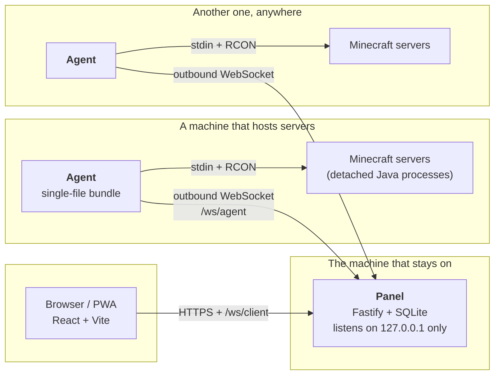

# Architecture

A tour of how MinecraftManagerOnline is put together, in English, for anyone who wants to read or
change the code. The design documents are in French and much longer (`docs/01` to `docs/07`); this
page is the map you need before opening them.

## The shape of it

**Panel** — one instance, on the machine that stays powered on. Fastify 5 with Zod 4 schemas, SQLite
through Drizzle (two files: `mmo.db` for state, `metrics.db` for time series, both in WAL), and it
serves the compiled React front itself. It listens on `127.0.0.1` and nothing else: reaching it from
outside is the job of the access layer (§ below), never of the HTTP server.

**Agent** — one per machine that hosts servers. It is a single JavaScript file produced by esbuild,
run by a pinned Node runtime that ships next to it, supervised by a micro-launcher that can roll back
to the previous version. It dials **out** to the panel over WebSocket and keeps that socket open.

**Servers** — ordinary Java processes, started detached, that keep running when the agent stops,
restarts or updates itself.

## Five invariants you will trip on

1. **Agents connect outbound; the panel never connects to an agent.** That is the whole reason this
   works behind CGNAT, 4G or a router you do not control. Any feature that would need the panel to
   reach an agent has to be expressed as a request travelling on the socket the agent opened.

2. **No native module in the agent.** Ever. It is a single bundle plus a stock Node runtime, so it
   installs on any machine without a compiler. (The panel followed: since 1.0.5 it has no compiled
   SQLite either — `node:sqlite` from the runtime, with a small hand-written Drizzle driver.) A
   dependency that needs `node-gyp` is not a dependency we can take.

3. **Minecraft processes outlive the agent.** They are detached on purpose, and after an agent
   restart they are re-adopted by matching PID + start time + command line. Stopping the agent must
   never kill a world; `KillMode=process`, `AbandonProcessGroup` and shawl's single-process stop are
   there for that.

4. **The panel owns identity.** Server IDs are minted by the panel, never by an agent. On disk, a
   `.mmo-server.json` marker in the server folder carries that identity, which is how a server
   survives a restore, a migration, or being moved to another machine.

5. **The protocol only grows.** `packages/protocol` holds Zod schemas shared by both sides; they are
   never `.strict()`, new fields are optional, and a panel must keep talking to an agent one version
   behind. Errors travel as codes from a closed enum — the interface translates them, the fine cause
   rides in `details.reason` rather than in a new code.

## Where things live

| Path                | What it is                                                                       |
| ------------------- | -------------------------------------------------------------------------------- |
| `apps/panel`        | HTTP API, WebSocket hubs, SQLite schema and migrations, services, access layer   |
| `apps/agent`        | Process supervision, file jail, backups, metrics, Java provisioning, self-update |
| `apps/web`          | React interface (Mantine, TanStack Router/Query, xterm), PWA, i18n               |
| `packages/protocol` | The panel↔agent message catalog: every schema, both directions                   |
| `packages/shared`   | Pure code both sides need (cron, time zones, server file parsing…)               |
| `tools/release`     | Building, signing, smoke-testing and publishing the archives                     |

## How a server gets driven

The console is **stdin** first: the agent writes to the process it started, and reads its stdout.
RCON is the complement — auto-provisioned by the agent, and the only channel available for a server
it re-adopted after a restart rather than launched itself. Metrics (CPU, RSS, players, TPS) are
sampled every 15 s and buffered when the panel is unreachable, then replayed with their original
timestamps. Every timestamp in the system is epoch milliseconds.

## Reaching the panel from outside

The panel binds to loopback, so exposure is a separate, pluggable layer with three modes:
**Tailscale** (the default — `tailscale serve` on the host, no port to open anywhere, and _zero
Tailscale API in our code_: we print the command, the user runs it), **direct** (public IPv6, your
own domain, an ACME certificate obtained by DNS-01), and **manual** (you already run a reverse
proxy). A machine can be attached to a route of its own: the panel can answer on both at once.

## Reading further

The design documents are the source of truth, in French: `docs/01-presentation` (vision and
glossary), `02-fonctionnalites` (scope), `03-socle-technique` (stack, distribution, security),
`04-base-de-donnees` (SQLite schema), `05-protocole` (message catalog), `06-minecraft` (launching,
detection, console, RCON), `07-plan-de-developpement` (phases and roadmap). Contribution rules,
including what is deliberately out of scope, are in [CONTRIBUTING.md](CONTRIBUTING.md).
