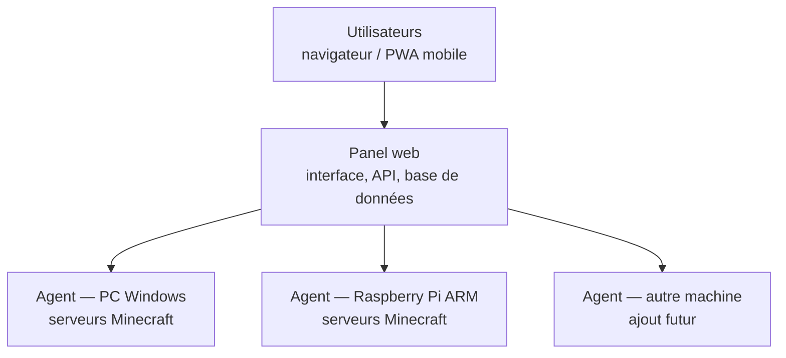

# MinecraftManagerOnline — Présentation du projet

## Vision

MinecraftManagerOnline (MMO) est une application web permettant de piloter à distance des serveurs Minecraft hébergés sur ses propres machines : les démarrer, les arrêter, envoyer des commandes, consulter les logs en temps réel, gérer les joueurs et les sauvegardes — depuis un PC ou un téléphone, où que l'on soit.

L'application est pensée pour être utilisable par des personnes **non développeuses** : tout se fait via une interface graphique claire, jamais via des fichiers texte ou des lignes de commande (un mode « avancé » reste disponible pour les utilisateurs experts).

## Principes structurants

Ces principes sont non négociables et guident toutes les décisions techniques :

1. **Multi-machines dès le premier jour** — l'application pilote des serveurs répartis sur plusieurs machines (PC Windows, Raspberry Pi, serveur Linux…). Chaque serveur appartient à une machine précise ; les ordres partent uniquement vers la bonne machine.
2. **Multi-OS et multi-architecture** — tout fonctionne sur Windows, Linux et macOS, en x64 comme en ARM (ex. Raspberry Pi).
3. **Aucun chemin en dur** — les répertoires contenant les serveurs sont configurables ; on peut en surveiller plusieurs, sur n'importe quel disque.
4. **Lancement maîtrisé** — l'application construit elle-même la commande de lancement Java (elle ne dépend pas des scripts `.bat`/`.sh` fournis avec les modpacks). Elle gère les différentes versions de Java requises selon la version de Minecraft.
5. **Sécurité par réseau privé** — l'accès distant passe par un VPN privé (Tailscale) : aucun port ouvert sur Internet, seuls les appareils invités voient l'application.
6. **PWA responsive** — une seule application web, installable sur PC et mobile, avec notifications push.
7. **Bilingue FR/EN** — tous les textes passent par des fichiers de traduction dès la première ligne de code.
8. **Auditable** — chaque action (qui a démarré/arrêté quoi, quand) est journalisée.

## Architecture

Le système repose sur deux programmes distincts :

- **Le panel** : le cerveau. Il héberge l'interface web, l'API et la base de données. Installé sur une seule machine.
- **L'agent** : un petit programme installé sur chaque machine qui héberge des serveurs Minecraft. Il exécute les ordres du panel : lancer/arrêter les processus Java, streamer les logs, surveiller les ressources, réaliser les backups.

Points clés :

- **C'est l'agent qui se connecte au panel** (connexion sortante) : traversée des pare-feux sans configuration.
- **Ajout d'une machine** : installer l'agent, coller un code d'appairage généré par le panel, c'est tout.
- Le panel et l'agent peuvent tourner **sur la même machine** (cas d'un seul PC) : la séparation est invisible pour l'utilisateur mais présente dès le premier jour.
- Le protocole panel ↔ agent est **versionné** ; le panel peut pousser les mises à jour des agents.
- Les conflits de ports sont vérifiés **par machine** (deux serveurs sur le port 25565 ne posent problème que sur la même machine).

## Utilisateurs et rôles

Application multi-comptes destinée à un cercle privé (le propriétaire et ses amis) :

| Rôle | Droits |
|---|---|
| Administrateur | Tout, y compris gestion des machines, des utilisateurs et des rôles |
| Opérateur | Démarrer/arrêter les serveurs, console, gestion des joueurs |
| Lecture seule | Consulter l'état, les logs et les statistiques |

## Glossaire

| Terme | Définition |
|---|---|
| Panel | L'application centrale : interface web + API + base de données |
| Agent | Le programme installé sur chaque machine hébergeant des serveurs |
| Machine (nœud) | Un ordinateur enregistré auprès du panel via un agent |
| Serveur | Une instance de serveur Minecraft (dossier + configuration + processus) |
| Répertoire surveillé | Un dossier scanné automatiquement pour détecter des serveurs |

## Documents du projet

Guide utilisateur (installation et prise en main) : [docs/guide/](guide/installation.md). Documents de conception :

- [02-fonctionnalites.md](02-fonctionnalites.md) — liste complète des fonctionnalités (V1 / futur)
- [03-socle-technique.md](03-socle-technique.md) — stack, distribution, couche d'accès, sécurité, tests
- [04-base-de-donnees.md](04-base-de-donnees.md) — schéma SQLite complet et règles d'exploitation
- [05-protocole.md](05-protocole.md) — protocole panel ↔ agent (catalogue des messages)
- [06-minecraft.md](06-minecraft.md) — lancement, détection et pilotage des serveurs Minecraft
- [07-plan-de-developpement.md](07-plan-de-developpement.md) — feuille de route en 13 phases jusqu'à la 1.0
