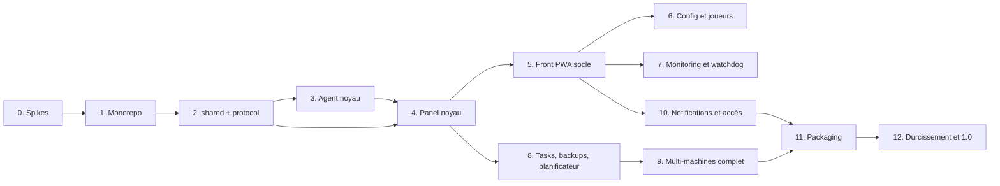

# 07 — Plan de développement

Feuille de route complète jusqu'à la release 1.0. Pas de MVP : chaque phase livre une brique **complète et testée** de l'application finale ; l'ordre minimise les retours en arrière (les fondations d'abord, l'UI branchée sur du réel ensuite).

Tailles relatives : **S** (quelques sessions), **M** (une brique substantielle), **L** (gros chantier).

## Vue d'ensemble et dépendances

Les jalons du protocole (doc 05 §1) se répartissent ainsi : **jalon A** (req/res + events + console `seq`) → phases 3–4 ; **jalon B** (tasks) → phase 8 ; **jalon C** (transferts binaires) → phases 8–9.

---

## Phase 0 — Spikes de validation `S`

Les trois vérifications listées en doc 03 §10, **avant toute ligne de code de l'agent** :

1. **EOF stdin** : matrice versions × loaders (1.12 Forge, 1.16 Forge, 1.20 NeoForge, Fabric, Vanilla) — le serveur survit-il à la fermeture du pipe stdin ? → décide le mode de lancement du process (stdin pipé ou non) et la faisabilité du mode `detached` tel que spécifié.
2. **Monitoring Windows 11 24H2** : `systeminformation`/`pidusage` sans `wmic` → valide ou remplace (fallback PowerShell CIM).
3. **zstd dans Node 24** : API `node:zlib` streaming → confirme gzip par défaut ou active la capacité zstd.

**Livrable** : notes de spike dans `docs/spikes/`, docs 03/05/06 amendés si besoin.

## Phase 1 — Fondations monorepo `S`

- pnpm workspaces + Turborepo, `packages/config` (tsconfig strict, eslint, prettier), squelettes `apps/panel`, `apps/web`, `apps/agent`, `packages/shared`, `packages/protocol`.
- CI GitHub Actions : matrice windows / ubuntu / **ubuntu-arm** / macos, build + tests.
- Conventions actées dans un `CONTRIBUTING.md` : commits, i18n obligatoire, migrations jamais éditées après merge, règle « pas de `.strict()` dans les schémas protocole », règle « aucun module natif dans l'agent ».

**Terminé quand** : `pnpm build && pnpm test` verts sur les 4 plateformes de CI.

## Phase 2 — `packages/shared` et `packages/protocol` `M`

- **shared** : structure i18n `fr`/`en` ; mapping MC→Java (manifest Mojang + table fallback + override) ; parsing de logs (2 formats + rattachement stacktraces) ; heuristiques de détection (algorithme doc 06 §2) — le tout testé sur des **fixtures copiées de vrais dossiers** de `E:\Minecraft\Server` (structures ATM, FTB, DawnCraft, Vanilla, anonymisées).
- **protocol** : enveloppe, codes d'erreur, schémas Zod du jalon A, couche RPC typée (client + serveur), négociation de version, tests de contrat sur fixtures.

**Terminé quand** : la détection identifie correctement loader/version/RAM sur ≥ 90 % des fixtures réelles, le reste tombant proprement en « à configurer ».

## Phase 3 — Agent : noyau local `L`

- `launcher.js` (minuscule, figé, sur-testé — swap/rollback/spawn, rien d'autre).
- Process manager : 4 templates de lancement + flags injectés (doc 06 §1), spawn détaché, persistance PID + heure + cmdline, **ré-adoption**, séquence d'arrêt stop→RCON→kill, détection readiness/crash/EULA.
- Console : capture stdout/stderr UTF-8, ring buffer + `seq` persisté, parsing des lignes.
- Scan/détection branché sur `shared` ; client RCON maison (file sérialisée) ; auto-provisionnement RCON.
- **Fake Java server** (harnais de test : `Done`, joins, crash, freeze, RCON, délais) — l'investissement de test le plus rentable du projet.
- CLI de développement locale (`mmo-agent dev`) pour piloter sans panel.

**Terminé quand** : sur les 3 OS de CI (fake server) **et** sur un vrai modpack local : start → `Done` détecté → commandes → stop propre → crash simulé détecté → ré-adoption après kill de l'agent.

## Phase 4 — Panel : noyau `L`

- Fastify + drizzle (migrations `mmo.db` + `metrics.db`), auth sessions/argon2/RBAC, bootstrap first-run (API), audit log, bus d'événements interne.
- WS `/ws/agent` : appairage (codes hachés, rate-limit), auth, heartbeat/offline, `sync.state` + **réconciliation** (états, `desired_state`, sessions joueurs orphelines), dédup/idempotence, `event.ack`.
- WS `/ws/client` : diffusion console/états/événements vers les navigateurs.
- API REST : machines, serveurs, start/stop/restart/kill, console, commandes.

**Terminé quand** : test d'intégration panel + agent réels in-process : appairage → scan → start → console live → coupure/reconnexion avec rattrapage `seq` → stop. Rejouable from scratch (migrations incluses).

## Phase 5 — Front PWA : socle `L`

- Vite/React/Mantine : AppShell responsive (sidebar PC / navigation basse mobile), thème sombre/clair, i18n branchée, PWA installable.
- Auth + first-run wizard (UI), dashboard (stats machines + cartes serveurs groupées par machine, actions start/stop), page serveur : onglets avec **Console** (xterm, envoi de commandes, autocomplétion V1, historique ↑), état temps réel via `/ws/client`.
- Pages machines (appairage avec one-liner affiché, statut).

**Terminé quand** : e2e Playwright (desktop + mobile, fr + en) : login → dashboard → start d'un serveur → commande console → réponse visible → stop. Lighthouse PWA installable.

> **Implémentation (phase 5, 2026-08-22)** : `apps/web` — AppShell (sidebar ≥ sm, navigation basse < sm), thème sombre/clair/système, fr/en, PWA ; wizard, login, dashboard (machines + cartes serveurs groupées, start/stop/restart/kill), page serveur (aperçu, console xterm, joueurs, événements, réglages), pages machines (ajout + code affiché une fois + one-liners, répertoires, scan, ajout de dossier, conflits), compte. Le panel sert le build (doc 03 §1). Critère atteint : suite Playwright `setup` + 4 projets (desktop/mobile × fr/en) contre panel + agent réels + fake Java server. **Dérogation** : Lighthouse ≥ 12 n'a plus de catégorie PWA — l'installabilité est vérifiée par `pwa.spec.ts` (manifest, icônes 192/512, service worker actif, coquille hors ligne). Non fait (volontaire) : Spotlight, graphiques, éditeurs de configuration (phase 6), push (phase 7+), page utilisateurs/réglages admin (l'API existe).

## Phase 6 — Configuration et joueurs `M`

- `config.get/set` agent (properties avec préservation des clés inconnues, JSON whitelist/ops/bans, routage commandes-ou-fichiers selon l'état du serveur).
- Éditeurs graphiques : server.properties expliqué champ par champ, whitelist/ops/bans avec avatars et résolution UUID (online + offline), EULA guidé.
- Explorateur de fichiers (jail, corbeille `.mmo-trash/`) + éditeur texte « mode avancé ».
- Joueurs : liste en ligne temps réel, kick/ban/pardon/op, historique de connexions (`player_sessions` + clôture sur stop/crash).

**Terminé quand** : scénario e2e « gérer une whitelist depuis un téléphone sans jamais voir un fichier », y compris serveur en marche vs arrêté.

## Phase 7 — Monitoring et watchdog `M`

- `metrics.sample` 15 s → `metrics.db` (lots + transactions groupées), job de downsampling/purge, graphiques historiques (+ uPlot si besoin en temps réel).
- TPS : chaîne de fallback complète + « installer spark en un clic » (jamais requis) + « TPS indisponible » honnête.
- Watchdog : crash (faisceau doc 06 §4) + freeze (sondes RCON), auto-restart borné, garde-fou RAM, détection de conflits de ports.

**Terminé quand** : crash et freeze simulés sur fake server → événements corrects, auto-restart borné par `crash_loop_max`, graphiques exacts après 48 h de données synthétiques (test du downsampling).

## Phase 8 — Tasks, backups, planificateur `L`

- Mécanisme **tasks** (jalon B) : table `tasks`, progression, annulation, journal WAL agent, reprise, réconciliation au boot du panel.
- **Transferts binaires** (jalon C) : chunks, fenêtre, reprise par offset, priorité basse — branchés sur download/upload de l'explorateur.
- Backups : création (à chaud via save-off/save-all), restauration avec backup de sécurité, rotation **locale agent** + `backup.rotated`, destination configurable, `VACUUM INTO` du panel lui-même.
- Planificateur : cron UI, start/stop/restart programmés + annonces (panel), plannings de backups poussés à l'agent (autonomes).

**Terminé quand** : backup planifié exécuté **panel éteint** puis synchronisé à la reconnexion ; restauration 1 clic vérifiée par checksum ; download d'une archive de plusieurs Go avec coupure/reprise en cours de route.

## Phase 9 — Multi-machines complet `M`

- Migration agent → agent : pré-checks cible, transfert direct + fallback relais, bascule en base, finalisation différée.
- `java.install` multi-fournisseur (Temurin → Zulu → x64 émulé) + mode relais panel.
- `agent.update` de bout en bout : signature Ed25519, exit 75, health-check, **rollback réellement testé** ; `runtime.update`.

**Terminé quand** : migration réelle d'un serveur entre deux machines (Windows → Linux ARM idéalement) ; mise à jour d'agent poussée avec un bundle volontairement cassé → rollback automatique constaté.

## Phase 10 — Notifications et couche d'accès `M`

- Web Push : VAPID, préférences par type d'événement, localisation par destinataire, onboarding iOS guidé (installation écran d'accueil), re-synchronisation des abonnements morts, centre de notifications in-app (fallback).
- Couche d'accès : mode `tailscale` (intégration `tailscale serve` documentée + testée, WS et frames binaires compris), mode `direct` (ACME DNS-01 intégré, client DynDNS, règles pare-feu affichées), mode `manual` documenté.
- `expose_mode` par serveur + test de joignabilité + « adresse à donner aux amis ».

**Terminé quand** : push reçu sur Android et iOS (PWA installée) pour un crash simulé ; panel accédé depuis un téléphone hors du réseau local dans les deux modes.

## Phase 11 — Packaging et installation `M`

- Archives des 4 plateformes (runtime épinglé + bundles), `install.ps1` / `install.sh` servis par le panel, services (shawl compte utilisateur / systemd / launchd), désinstallation propre.
- Release pipeline : build, signature des bundles (clé chez le mainteneur), publication des artefacts dans le panel.
- Documentation utilisateur (installation, ajout de machine, FAQ réseau).

**Terminé quand** : installation **from scratch** sur un Windows vierge et un Linux ARM en suivant uniquement la doc, reboot machine compris (services + `desired_state` restaurés).

## Phase 12 — Durcissement et release 1.0 `M`

- E2E complets fr/en, desktop/mobile, thèmes ; revue sécurité contre la checklist doc 03 §6 (+ audit des chemins jailés).
- Test d'échelle : ~56 serveurs détectés, 3–4 simultanés en fake, métriques 48 h.
- Vérification des purges/rétentions ; sauvegarde/restauration du panel lui-même ; passe d'accessibilité de base ; polish UI.
- Tag `v1.0.0`.

**Critères de release** : tous les « Terminé quand » ci-dessus verts + zéro fonctionnalité V1 du doc 02 manquante.

---

## Règles de conduite du projet

1. **Une phase = une ou plusieurs PR/commits cohérents + docs mis à jour.** Toute dérogation aux docs 03–06 est actée dans le doc concerné au moment où elle se décide.
2. **Les tests accompagnent le code, jamais « plus tard »** — le fake Java server et les fixtures réelles existent dès les phases 2–3 précisément pour ça.
3. **Le protocole n'évolue que par ajout** (champs optionnels, nouveaux types) ; toute rupture = bump de version + support N-1.
4. **i18n dès la première chaîne** ; aucune chaîne en dur dans le front ou les push.
5. Les fonctionnalités **Futur** du doc 02 (CurseForge, mods, carte, Discord, WoL) ne sont pas développées en 1.0 mais chaque phase vérifie qu'elle ne les bloque pas (bus d'événements, capacités du protocole, états de provisionnement).
