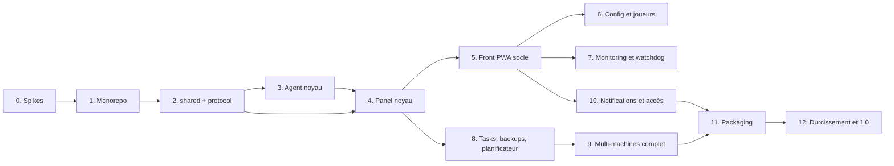

# 07 — Plan de développement

Feuille de route complète jusqu'à la release 1.0. Pas de MVP : chaque phase livre une brique **complète et testée** de l'application finale ; l'ordre minimise les retours en arrière (les fondations d'abord, l'UI branchée sur du réel ensuite).

Tailles relatives : **S** (quelques sessions), **M** (une brique substantielle), **L** (gros chantier).

## Vue d'ensemble et dépendances

Les jalons du protocole (doc 05 §1) se répartissent ainsi : **jalon A** (req/res + events + console `seq`) → phases 3–4 ; **jalon B** (tasks) → phase 8 ; **jalon C** (transferts binaires) → phases 8–9.

---

## Phase 0 — Spikes de validation `S`

Les trois vérifications listées en doc 03 §10, **avant toute ligne de code de l'agent** :

1. **EOF stdin** : matrice versions × loaders (1.12 Forge, 1.16 Forge, 1.20 NeoForge, Fabric, Vanilla) — le serveur survit-il à la fermeture du pipe stdin ? → décide le mode de lancement du process (stdin pipé ou non) et la faisabilité du mode `detached` tel que spécifié.
2. **Monitoring Windows 11 24H2** : `systeminformation`/`pidusage` sans `wmic` → valide ou remplace (fallback PowerShell CIM).
3. **zstd dans Node 24** : API `node:zlib` streaming → confirme gzip par défaut ou active la capacité zstd.

**Livrable** : notes de spike dans `docs/spikes/`, docs 03/05/06 amendés si besoin.

## Phase 1 — Fondations monorepo `S`

- pnpm workspaces + Turborepo, `packages/config` (tsconfig strict, eslint, prettier), squelettes `apps/panel`, `apps/web`, `apps/agent`, `packages/shared`, `packages/protocol`.
- CI GitHub Actions : matrice windows / ubuntu / **ubuntu-arm** / macos, build + tests.
- Conventions actées dans un `CONTRIBUTING.md` : commits, i18n obligatoire, migrations jamais éditées après merge, règle « pas de `.strict()` dans les schémas protocole », règle « aucun module natif dans l'agent ».

**Terminé quand** : `pnpm build && pnpm test` verts sur les 4 plateformes de CI.

## Phase 2 — `packages/shared` et `packages/protocol` `M`

- **shared** : structure i18n `fr`/`en` ; mapping MC→Java (manifest Mojang + table fallback + override) ; parsing de logs (2 formats + rattachement stacktraces) ; heuristiques de détection (algorithme doc 06 §2) — le tout testé sur des **fixtures copiées de vrais dossiers** de `E:\Minecraft\Server` (structures ATM, FTB, DawnCraft, Vanilla, anonymisées).
- **protocol** : enveloppe, codes d'erreur, schémas Zod du jalon A, couche RPC typée (client + serveur), négociation de version, tests de contrat sur fixtures.

**Terminé quand** : la détection identifie correctement loader/version/RAM sur ≥ 90 % des fixtures réelles, le reste tombant proprement en « à configurer ».

## Phase 3 — Agent : noyau local `L`

- `launcher.js` (minuscule, figé, sur-testé — swap/rollback/spawn, rien d'autre).
- Process manager : 4 templates de lancement + flags injectés (doc 06 §1), spawn détaché, persistance PID + heure + cmdline, **ré-adoption**, séquence d'arrêt stop→RCON→kill, détection readiness/crash/EULA.
- Console : capture stdout/stderr UTF-8, ring buffer + `seq` persisté, parsing des lignes.
- Scan/détection branché sur `shared` ; client RCON maison (file sérialisée) ; auto-provisionnement RCON.
- **Fake Java server** (harnais de test : `Done`, joins, crash, freeze, RCON, délais) — l'investissement de test le plus rentable du projet.
- CLI de développement locale (`mmo-agent dev`) pour piloter sans panel.

**Terminé quand** : sur les 3 OS de CI (fake server) **et** sur un vrai modpack local : start → `Done` détecté → commandes → stop propre → crash simulé détecté → ré-adoption après kill de l'agent.

## Phase 4 — Panel : noyau `L`

- Fastify + drizzle (migrations `mmo.db` + `metrics.db`), auth sessions/argon2/RBAC, bootstrap first-run (API), audit log, bus d'événements interne.
- WS `/ws/agent` : appairage (codes hachés, rate-limit), auth, heartbeat/offline, `sync.state` + **réconciliation** (états, `desired_state`, sessions joueurs orphelines), dédup/idempotence, `event.ack`.
- WS `/ws/client` : diffusion console/états/événements vers les navigateurs.
- API REST : machines, serveurs, start/stop/restart/kill, console, commandes.

**Terminé quand** : test d'intégration panel + agent réels in-process : appairage → scan → start → console live → coupure/reconnexion avec rattrapage `seq` → stop. Rejouable from scratch (migrations incluses).

## Phase 5 — Front PWA : socle `L`

- Vite/React/Mantine : AppShell responsive (sidebar PC / navigation basse mobile), thème sombre/clair, i18n branchée, PWA installable.
- Auth + first-run wizard (UI), dashboard (stats machines + cartes serveurs groupées par machine, actions start/stop), page serveur : onglets avec **Console** (xterm, envoi de commandes, autocomplétion V1, historique ↑), état temps réel via `/ws/client`.
- Pages machines (appairage avec one-liner affiché, statut).

**Terminé quand** : e2e Playwright (desktop + mobile, fr + en) : login → dashboard → start d'un serveur → commande console → réponse visible → stop. Lighthouse PWA installable.

> **Implémentation (phase 5, 2026-08-22)** : `apps/web` — AppShell (sidebar ≥ sm, navigation basse < sm), thème sombre/clair/système, fr/en, PWA ; wizard, login, dashboard (machines + cartes serveurs groupées, start/stop/restart/kill), page serveur (aperçu, console xterm, joueurs, événements, réglages), pages machines (ajout + code affiché une fois + one-liners, répertoires, scan, ajout de dossier, conflits), compte. Le panel sert le build (doc 03 §1). Critère atteint : suite Playwright `setup` + 4 projets (desktop/mobile × fr/en) contre panel + agent réels + fake Java server. **Dérogation** : Lighthouse ≥ 12 n'a plus de catégorie PWA — l'installabilité est vérifiée par `pwa.spec.ts` (manifest, icônes 192/512, service worker actif, coquille hors ligne). Non fait (volontaire) : Spotlight, graphiques, éditeurs de configuration (phase 6), push (phase 7+), page utilisateurs/réglages admin (l'API existe).

## Phase 6 — Configuration et joueurs `M`

- `config.get/set` agent (properties avec préservation des clés inconnues, JSON whitelist/ops/bans, routage commandes-ou-fichiers selon l'état du serveur).
- Éditeurs graphiques : server.properties expliqué champ par champ, whitelist/ops/bans avec avatars et résolution UUID (online + offline), EULA guidé.
- Explorateur de fichiers (jail, corbeille `.mmo-trash/`) + éditeur texte « mode avancé ».
- Joueurs : liste en ligne temps réel, kick/ban/pardon/op, historique de connexions (`player_sessions` + clôture sur stop/crash).

**Terminé quand** : scénario e2e « gérer une whitelist depuis un téléphone sans jamais voir un fichier », y compris serveur en marche vs arrêté.

> **Implémentation (phase 6, 2026-08-22)** : protocole + `player.action` / `player.resolve`, schémas typés des fichiers (`CONFIG_DATA_SCHEMAS`), `config.set` enrichi (`commands`, `warnings`, `sha256`). Agent 0.6.0 : `fs.*` jailé + corbeille (doc 05 §6), `logs.*`, `config.get/set` et actions joueurs routées commandes-ou-fichiers (doc 06 §7), résolution UUID usercache/Mojang/hors ligne, fake Java server enrichi (whitelist/op/ban/kick qui réécrivent les JSON). Panel 0.6.0 : relais REST + audit + événements, historique `player_sessions`. Web : onglets **Joueurs** (en ligne avec kick/ban/op/deop, liste blanche avec interrupteur, opérateurs avec niveau, bannis joueurs + IP, historique ; avatars + source de résolution visible), **Configuration** (`server.properties` expliqué clé par clé en fr/en — 60 clés, catégories, types, défauts, clés inconnues préservées, patch minimal, `expectedSha256`, « redémarrer maintenant »), **Fichiers** (explorateur jailé, dossier/fichier/renommer/dupliquer/corbeille, éditeur texte ≤ 512 Ko avec détection de conflit), **Journaux** (liste + recherche exécutée par l'agent), EULA guidée (explication, lien, case à cocher). Critère atteint : `whitelist.spec.ts` joué desktop + mobile (Pixel 7) × fr + en — ajout serveur arrêté (fichier écrit par l'agent), démarrage, ajout/retrait en marche (commandes, fichier réécrit par le serveur), activation à chaud, et vérification que ni l'onglet Fichiers ni Configuration n'ont été ouverts ; le fichier est contrôlé sur disque par le test. Non fait (volontaire) : upload/download (phase 8), recherche de joueurs par autocomplétion `usercache`, édition des dates d'expiration de ban.

## Phase 7 — Monitoring et watchdog `M`

- `metrics.sample` 15 s → `metrics.db` (lots + transactions groupées), job de downsampling/purge, graphiques historiques (+ uPlot si besoin en temps réel).
- TPS : chaîne de fallback complète + « installer spark en un clic » (jamais requis) + « TPS indisponible » honnête.
- Watchdog : crash (faisceau doc 06 §4) + freeze (sondes RCON), auto-restart borné, garde-fou RAM, détection de conflits de ports.

**Terminé quand** : crash et freeze simulés sur fake server → événements corrects, auto-restart borné par `crash_loop_max`, graphiques exacts après 48 h de données synthétiques (test du downsampling).

> **Implémentation (phase 7, 2026-08-22)** : protocole par ajout (`tpsSource`, alerte `ram`, DTO métriques + message `metrics.sample` de `/ws/client`), parsing TPS et pattern `FAILED TO BIND` dans `shared`. Agent 0.7.0 : échantillonneur CPU **par cycles** (sidecar PowerShell embarqué, sans dépendance — dérogation doc 03 §1) / `/proc` / `ps` avec repli `ticks`, `MetricsCollector` 15 s + tampon hors ligne 1 h rejoué, `TpsProbe` (chaîne de fallback, mémorisation, pause 10 min), watchdog local (crash borné par `crashLoopMax` par fenêtre 10 min, freeze par sondes RCON → `freeze_kill`, garde-fou RAM, conflits de ports), politique persistée. Panel 0.7.0 : `MetricsService` (lots, downsampling exact 1 min/1 h, purge, vacuum), API métriques, diffusion temps réel, audit des actions automatiques. Web : onglet **Métriques** (graphiques SVG maison — pas d'uPlot : ≤ 2 880 points par série, aucune dépendance ; plages 1 h → 30 j, résolution annoncée, bande min/max, ligne « tas max »), métriques machine, TPS honnête, avertissement `ticks`, libellés watchdog dans les événements. Critère atteint : `agent.watchdog.test.ts` (crash ×3 → restart/restart/gave_up ; freeze → kill_restart → `freeze_kill` → relance → gave_up ; `metrics.sample` + rejeu après coupure ; `port.conflict`), `panel/services/metrics.test.ts` (50 h synthétiques, agrégats exacts), e2e `metrics.spec.ts`. Non fait (volontaire) : « installer spark en un clic » (phase 8, transferts), mode inspection 5 s non persisté (l'intervalle est réglable globalement, rien n'est jeté), MSPT en agrégé, push (phase 10).

## Phase 8 — Tasks, backups, planificateur `L`

- Mécanisme **tasks** (jalon B) : table `tasks`, progression, annulation, journal WAL agent, reprise, réconciliation au boot du panel.
- **Transferts binaires** (jalon C) : chunks, fenêtre, reprise par offset, priorité basse — branchés sur download/upload de l'explorateur.
- Backups : création (à chaud via save-off/save-all), restauration avec backup de sécurité, rotation **locale agent** + `backup.rotated`, destination configurable, `VACUUM INTO` du panel lui-même.
- Planificateur : cron UI, start/stop/restart programmés + annonces (panel), plannings de backups poussés à l'agent (autonomes).

**Terminé quand** : backup planifié exécuté **panel éteint** puis synchronisé à la reconnexion ; restauration 1 clic vérifiée par checksum ; download d'une archive de plusieurs Go avec coupure/reprise en cours de route.

> **Implémentation (phase 8, 2026-08-22)** : protocole par ajout — jalon B (`task.progress/completed/failed`, `task.cancel/ackResult/list`, `backup.create/list/restore/delete`, `backup.rotated`, `fs.fetch`) et jalon C (frames binaires, `fs.download.start`/`fs.upload.start`, `fs.transfer.ack/done/cancel` bidirectionnels, moteurs `TransferSender`/`TransferReceiver` partagés) ; `@mmo/shared` : cron 5 champs et codecs zstd/gzip. Agent 0.8.0 : journal WAL + `TaskRunner`, tar maison, archives `.tar.zst`/`.tar.gz` + manifeste, `BackupService` (à chaud, restauration vérifiée, rotation), plannings locaux autonomes, transferts avec reprise, `fs.fetch`. Panel 0.8.0 : tables `tasks`/`backups`/`backup_policies`/`scheduled_tasks` vivantes, `TasksService` (diffusion `task.update`, `stalled`, réconciliation), `BackupsService`, `SchedulerService` (actions exécutées par le panel, avertissements avant stop/restart), `TransferService` (download HTTP en flux avec reprise transparente, upload), `PanelBackupService` (`VACUUM INTO`), routes REST. Web : onglets **Sauvegardes** (créer, restaurer 1 clic avec sécurité + relance, télécharger, supprimer, politiques cron avec préréglages) et **Planificateur**, indicateur global des tasks (badge + liste), progression en direct, upload/download dans Fichiers (XHR avec progression), « installer spark en un clic » dans Métriques. Critères atteints : `agent.backup.test.ts` + `integration/phase8.test.ts` (backup planifié exécuté sans panel puis synchronisé ; restauration refusée sur archive altérée puis réussie avec checksum ; download/upload coupés puis repris par offset avec sha256 final exact — le volume de plusieurs Go n'est pas joué en CI, la mécanique l'est à chunks réduits) ; e2e `backups.spec.ts`. Non fait (volontaire) : migration agent→agent (phase 9), `java.install` (phase 11), mode « reprise d'une task » autre que par offset de transfert (une task interrompue est rejouable depuis le panel), upload de dossiers entiers.

## Phase 9 — Multi-machines complet `M`

- Migration agent → agent : pré-checks cible, transfert direct + fallback relais, bascule en base, finalisation différée.
- `java.install` multi-fournisseur (Temurin → Zulu → x64 émulé) + mode relais panel.
- `agent.update` de bout en bout : signature Ed25519, exit 75, health-check, **rollback réellement testé** ; `runtime.update`.

**Terminé quand** : migration réelle d'un serveur entre deux machines (Windows → Linux ARM idéalement) ; mise à jour d'agent poussée avec un bundle volontairement cassé → rollback automatique constaté.

> **Implémentation (phase 9, 2026-08-22)** : protocole par ajout — `migration.export/precheck/import/finalize`, `transfer.serve`, `java.install/remove`, `agent.update`, `runtime.update`, événement critique `agent.updateResult`, `auth.hello.runtimeVersion`, codes `E_PRECHECK_FAILED`/`E_SIGNATURE_INVALID`/`E_UNREACHABLE` (doc 05 §6, §8, §9). Agent 0.9.0 : migration (listener one-shot + import direct/relais avec reprise `Range`, finalisation `.migrated-<date>`), installeur Java multi-sources, updater signé + launcher figé (doc 03 §3). Panel 0.9.0 : `MigrationsService`, `JavaRuntimesService`, `ReleasesService`, jetons de relais `/api/relay/:token`, migration SQL `0002_phase9` (doc 04 §2, §5). Web : migration (modale + pré-checks + suivi), cartes Agent et Java par machine, releases d'agent (admin). **Critères** : migration réelle jouée par `apps/panel/src/integration/phase9.test.ts` entre deux agents réels in-process (direct puis relais, serveur en marche relancé sur la cible) — **pas encore entre deux machines physiques ni Windows → Linux ARM** (à jouer à la main avant la 1.0, l'agent Linux ARM n'étant pas encore packagé : phase 11) ; rollback constaté par `launcher.test.ts` avec un bundle volontairement cassé (2 crashs → N-1) et un bundle muet (health-check 30 s). Dette : e2e Playwright de migration (le fixture n'a qu'un agent), `rolled_back` inutilisé, mini-protocole d'amorçage figé, clé de signature de release.

## Phase 10 — Notifications et couche d'accès `M`

- Web Push : VAPID, préférences par type d'événement, localisation par destinataire, onboarding iOS guidé (installation écran d'accueil), re-synchronisation des abonnements morts, centre de notifications in-app (fallback).
- Couche d'accès : mode `tailscale` (intégration `tailscale serve` documentée + testée, WS et frames binaires compris), mode `direct` (ACME DNS-01 intégré, client DynDNS, règles pare-feu affichées), mode `manual` documenté.
- `expose_mode` par serveur + test de joignabilité + « adresse à donner aux amis ».

**Terminé quand** : push reçu sur Android et iOS (PWA installée) pour un crash simulé ; panel accédé depuis un téléphone hors du réseau local dans les deux modes.

> **Implémentation (phase 10, 2026-08-22)** : protocole client par ajout — `NOTIFICATION_TYPES` + `notificationTypeOf()`, DTO push/préférences/centre, `AccessStatusDto`, `AccessTestResult`, `FirewallRulesDto`, `ServerAddressDto`, `ReachabilityResult`, `EDITABLE_SETTINGS` += `access.*`, `machineDto.addresses/tailnetHost/publicHost`, codes `E_PUSH_DISABLED`/`E_ACCESS_NOT_CONFIGURED`/`E_ACME_FAILED`/`E_DNS_FAILED` ; `machineInfo.addresses` (doc 05 §3). Shared : textes push `common:notify.*` fr/en. Agent 0.10.0 : `networkAddresses()`. Panel 0.10.0 : Web Push maison (doc 03 §1, vecteur RFC 8291), `NotificationsService` (préférences, livraison localisée par destinataire, purge 404/410, centre + curseur), `AccessService` (doc 03 §5 : tailscale serve affiché, test HTTP+WS+binaire via `/ws/probe`, ACME DNS-01 maison + DER/CSR, fournisseurs DNS manuel/DuckDNS/Cloudflare/générique, HTTPS à chaud, DynDNS, pare-feu, adresse joueurs, Server List Ping), routes `http/routes/phase10.ts`, migration `0003_phase10`. Web : centre de notifications (cloche, non-lus, marquer lu, rafraîchi par le temps réel), page Compte (préférences, push avec onboarding iOS et appareils), page **Réglages** admin (général, accès par mode avec certificat/TXT manuel/DynDNS/pare-feu/test, push), indicateur d'accès dans l'en-tête, carte « Accès joueurs » (vue d'ensemble serveur) et « Adresses pour les joueurs » (page machine), SW push (`public/sw-push.js` via `importScripts`), `lib/push.ts` (resync au démarrage). Tests : panel `push/webpush.test.ts` (RFC), `notifications.test.ts` (faux endpoint, fr/en, 410 purgé, préférences, centre), `access/acme.test.ts` (faux ACME : JWS, CSR, badNonce), `access/dns.test.ts`, `access.test.ts` (proxy + frame binaire, DNS-01 manuel → HTTPS réel + WSS, DynDNS, adresses, pare-feu, ping) ; agent `connection/addresses.test.ts` ; web `notifications/notifications.test.tsx`. **Critère non rejoué de bout en bout** : push réel sur Android/iOS et accès depuis un téléphone hors réseau (pas de tailnet ni de domaine en CI ; mécanique complète testée en local, à valider à la main lors de la phase 11 avec l'installation from scratch).

## Phase 11 — Packaging et installation `M`

- Archives des 4 plateformes (runtime épinglé + bundles), `install.ps1` / `install.sh` servis par le panel, services (shawl compte utilisateur / systemd / launchd), désinstallation propre.
- Release pipeline : build, signature des bundles (clé chez le mainteneur), publication des artefacts dans le panel.
- Documentation utilisateur (installation, ajout de machine, FAQ réseau).

**Terminé quand** : installation **from scratch** sur un Windows vierge et un Linux ARM en suivant uniquement la doc, reboot machine compris (services + `desired_state` restaurés).

> **Implémentation (phase 11, 2026-08-22)** : `tools/release/` (archives reproductibles des 4 plateformes + archive du panel, smoke, publication, signature hors dépôt — doc 03 §3), agent 0.11.0 (commande `pair`, launcher `--version` one-shot), panel 0.11.0 (`DistributionService`, routes `/install.ps1`, `/install.sh`, `/dist/*`, `/api/dist`, dépôt admin, publication automatique de la release d'agent), scripts `apps/panel/install/install.{sh,ps1}` (shawl compte utilisateur / systemd `KillMode=process` / launchd `AbandonProcessGroup`, mode utilisateur sans root, hors ligne, désinstallation), web (carte Distribution dans Réglages), CI (smoke par OS + job archives, workflow `release.yml`), guide utilisateur `docs/guide/` (installation, ajout de machine, FAQ réseau). Tests : `distribution.test.ts` (panel), `connection.test.ts` (`pairOnly`), `launcher.test.ts` (one-shot), `distribution.test.tsx` (web). **Critère partiellement rejoué** : `install.sh --user-service` de bout en bout dans WSL (systemd) et `install.ps1 -NoService` sur Windows réel, archive du panel démarrée from scratch ; **restent à jouer à la main** (élévation/machines vierges indisponibles) : service shawl + reboot Windows, Linux ARM réel (`sudo`), launchd, et les critères des phases 9–10 (migration Windows → Linux ARM, push Android/iOS, accès hors réseau) — prévus en ouverture de phase 12.

## Phase 12 — Durcissement et release 1.0 `M`

- E2E complets fr/en, desktop/mobile, thèmes ; revue sécurité contre la checklist doc 03 §6 (+ audit des chemins jailés).
- Test d'échelle : ~56 serveurs détectés, 3–4 simultanés en fake, métriques 48 h.
- Vérification des purges/rétentions ; sauvegarde/restauration du panel lui-même ; passe d'accessibilité de base ; polish UI.
- Tag `v1.0.0`.

**Critères de release** : tous les « Terminé quand » ci-dessus verts + zéro fonctionnalité V1 du doc 02 manquante.

> **Ouverture de phase 12 (2026-08-22) — critères des phases 9–11 rejoués à la main** avec le guide `docs/guide/installation.md` et l'archive du panel (`build.mjs --panel`, panel démarré from scratch sur `172.26.0.1:3100`, wizard, machines créées, one-liners tels qu'affichés par le panel). **Windows 11** : `install.ps1` complet avec élévation UAC → service shawl, machine `online`, serveur Vanilla 1.20.1 (copie) démarré, `Stop-Service` instantané avec **Java survivant**, relance → ré-adoption détachée + RCON ; `-Uninstall` (service supprimé, Java intact) puis réinstallation → ré-adoption. **Linux (WSL Ubuntu 22.04, systemd)** : `install.sh` système (root ; le relais `sudo` n'a pas pu être joué sans TTY), compte `mmo`, unit `KillMode=process`, serveur démarré sous `mmo` avec le JDK 21 système, `systemctl stop` → **Java survivant**, relance → ré-adoption, arrêt propre par RCON (mode détaché), `--uninstall --purge`. **Écarts corrigés** : (1) fenêtre élevée sous **PowerShell 7** : `Get-WmiObject` n'existe plus → exception muette et fenêtre fermée (→ `Invoke-CimMethod`, `trap` global, transcript `%TEMP%\mmo-install.log` cité par le parent) ; (2) service créé en **démarrage manuel** par `shawl add` (→ `sc config start= auto`) ; (3) compte Windows **sans mot de passe** (cas réel du poste de test) : l'ouverture de session de service est refusée (erreur 1327, événement 7038) → repli explicite sur `LocalSystem` quand le mot de passe saisi est vide, et diagnostic en clair si `Start-Service` échoue ; (4) sous systemd, l'agent **ne quittait jamais** après SIGTERM (journal « shutting down » puis processus vivant → SIGKILL à `TimeoutStopSec` 60 s, unit `failed`, process orphelin) : `main.ts` pose désormais une sortie explicite après `agent.stop()` et `dispose()` `unref()` les tubes du serveur détaché — arrêt en < 1 s vérifié ; (5) `list via rcon failed (rcon connection closed)` systématique à la ré-adoption : vanilla coupe la connexion quand commande et paquet junk arrivent dans une même lecture (doc 06 §5) — corrigé, test `--rcon-strict-read`. **Restent à jouer** : reboot Windows (installation laissée en place sur le poste, procédure dans le relais de session), relais `sudo` de `install.sh` en terminal interactif, Linux ARM réel, launchd macOS, migration Windows → Linux ARM, push Android/iOS, accès hors réseau.
>
> **Phase 12 — test d'échelle (2026-08-23)** : (a) **copies réelles** — miroir léger de `E:\Minecraft\Server` (55 dossiers, racine + `mods/` + argfiles copiés, `libraries/` en fichiers vides, mondes/backups ignorés → `D:\mmo-test\scale`, 17 Go) scanné par `mmo-agent scan` : **53 serveurs détectés en 8 s** (tous loader + version, 3 en confiance `medium` : installer seul, vanilla sans `version.json`), les 2 non détectés sont des dossiers sans serveur ; (b) **test automatisé** `panel/integration/scale.test.ts` — 56 serveurs (fixtures de détection dupliquées, ports distincts) détectés par un agent réel en **≈ 0,5 s**, `GET /api/servers` < 250 ms, second scan idempotent, **4 démarrages simultanés** de fakes avec métriques temps réel puis arrêts, puis **48 h de métriques** synthétiques pour les 56 serveurs (11 520 échantillons × 56 = 645 k lignes) ingérées avec le job horaire : **6,5 s** ingestion + agrégats, requêtes 48 h (1 min, ≤ 2 880 points) / 7 j (1 h) / 1 h (brut) en **< 10 ms**, brut purgé à 48 h. **Écart corrigé** : `ensureRcon` n'était pas sérialisé — quatre démarrages simultanés lisaient l'état, sondaient les ports en parallèle et retenaient le **même port RCON** (3 serveurs sur 4 crashaient au bind) → allocation sérialisée par chaîne de promesses + relecture de l'état courant (`server-manager.ts`).
>
> **Phase 12 — avancement (2026-08-22)** : **revue sécurité doc 03 §6** faite (deux audits, 10 correctifs dont un contournement d'authentification par pourcent-encodage et le brûlage anonyme des codes d'appairage ; limites acceptées et dette listées dans doc 03 §6). **E2E** : `settings.spec.ts` (thèmes clair/sombre/système persistants, notifications de bout en bout — préférence → événement → cloche → centre → lu, Réglages admin : URL publique, test de joignabilité réel via `/ws/probe`, distribution déposée par l'API puis effacée) joué desktop + mobile × fr + en ; suite complète **34 tests** (5 projets). Restent : test d'échelle, purges/rétentions, sauvegarde/restauration du panel, accessibilité, polish, clé de release, tag.

---

## Règles de conduite du projet

1. **Une phase = une ou plusieurs PR/commits cohérents + docs mis à jour.** Toute dérogation aux docs 03–06 est actée dans le doc concerné au moment où elle se décide.
2. **Les tests accompagnent le code, jamais « plus tard »** — le fake Java server et les fixtures réelles existent dès les phases 2–3 précisément pour ça.
3. **Le protocole n'évolue que par ajout** (champs optionnels, nouveaux types) ; toute rupture = bump de version + support N-1.
4. **i18n dès la première chaîne** ; aucune chaîne en dur dans le front ou les push.
5. Les fonctionnalités **Futur** du doc 02 (CurseForge, mods, carte, Discord, WoL) ne sont pas développées en 1.0 mais chaque phase vérifie qu'elle ne les bloque pas (bus d'événements, capacités du protocole, états de provisionnement).
